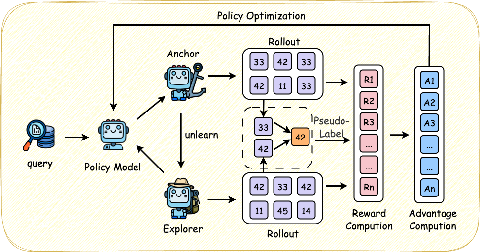
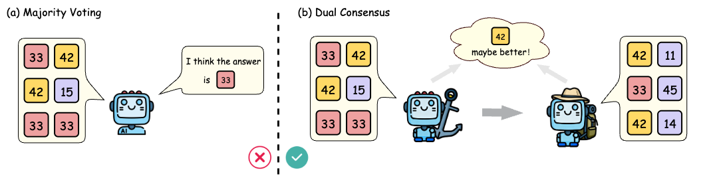

<h1 align="center"> Dual Consensus: Escaping from Spurious Majority in Unsupervised RLVR via Two-Stage Vote Mechanism</h1>

<div align="center">
<a href='https://arxiv.org/abs/2603.16223'></a>
<a href='https://github.com/v0yager33/DualConsensus'></a>
</div>

> [!NOTE]
> Official codebase for the paper **"[Dual Consensus: Escaping from Spurious Majority in Unsupervised RLVR via Two-Stage Vote Mechanism](https://arxiv.org/)"**. The training code is based on the [verl](https://github.com/volcengine/verl) framework.


<div align="center">

</div>

## Abstract
We propose Dual Consensus Reinforcement Learning (DCRL), a novel self-supervised training method which is capable of generating more reliable learning signals through a two-stage consensus mechanism. The model initially acts as an anchor, producing dominant responses; then it serves as anexplorer, generating diverse auxiliary signals via a temporary unlearning process. The final training target is derived from the harmonic mean of these two signal sets. Notably, the process operates entirely without external models or supervision. Across eight benchmarks and diverse domains, DCRL consistently improves Pass@1 over majority vote while yielding more stable training dynamics. These results demonstrate that DCRL establishes a scalable path toward stronger reasoning without labels.

## Methodology


The model assumes two roles to generate diverse reasoning signals:
- **Anchor Model**: Cloned from the current policy, generates dominant reasoning trajectories to capture the model's confident mode.
- **Explorer Model**: Derived from the anchor via a temporary unlearning process to suppress dominant spurious patterns and explore diverse alternative trajectories.


Instead of naive majority vote, DCRL uses the harmonic mean of answer probabilities from anchor and explorer rollouts to select pseudo-labels:


$$
y^* = \mathop{\arg\max}_{a\in\mathcal{A}} \frac{2 p_0(a) p_1(a)}{p_0(a)+p_1(a)}
$$

The consensus pseudo-label is selected as the answer maximizing the harmonic mean of probabilities, and a hierarchical reward scheme is designed to stabilize training:
- Full reward for trajectories matching the consensus pseudo-label
- Modest reserved reward for trajectories matching the anchor's majority answer
- Zero reward otherwise

A dynamic sampling strategy regulated by the consensus rate (proportion of anchor trajectories consistent with anchor's majority answer) to adjust the contribution of anchor/explorer rollouts:
- When consensus rate ≤ 1/2: Only anchor trajectories are used for training.
- When consensus rate > 1/2: Both anchor and explorer trajectories are used.

## Installation
### Environment Setup
```bash
git clone https://github.com/v0yager33/DualConsensus.git
cd DualConsensus

conda create -n dcrl python==3.10
conda activate dcrl

# Option 1: Quick install via script (recommended)
bash install_deps.sh

# Option 2: Manual install
pip install -r requirements.txt
pip install -e ./verl
```

### Prepare Datasets
```bash
python3 data/data_preprocess.py --input ./data/train/dapo14k.jsonl --output ./data/train/dapo14k.parquet

python3 data/data_preprocess.py --input ./data/test/math.json --output ./data/test/math.parquet
```

## Reproduce DCRL
```bash
bash verl/examples/DualConsensus/run_qwen3_8b_base.sh
```

Detailed results are available in the [paper](https://arxiv.org/abs/2603.16223).

## Acknowledgements
Our codebase is built on [VeRL](https://github.com/volcengine/verl). Special thanks to the VeRL team for their excellent infrastructure.

## Citation
If you find our work useful, we will appreciate it if you consider citing our paper:

```
@article{du2026dualconsensus,
    title={Dual Consensus: Escaping from Spurious Majority in Unsupervised RLVR via Two-Stage Vote Mechanism},
    author={Kaixuan Du and Meng Cao and Hang Zhang and Yukun Wang and Xiangzhou Huang and Ni Li},
    journal={arXiv preprint arXiv:2603.16223},
    year={2026}
}
```
